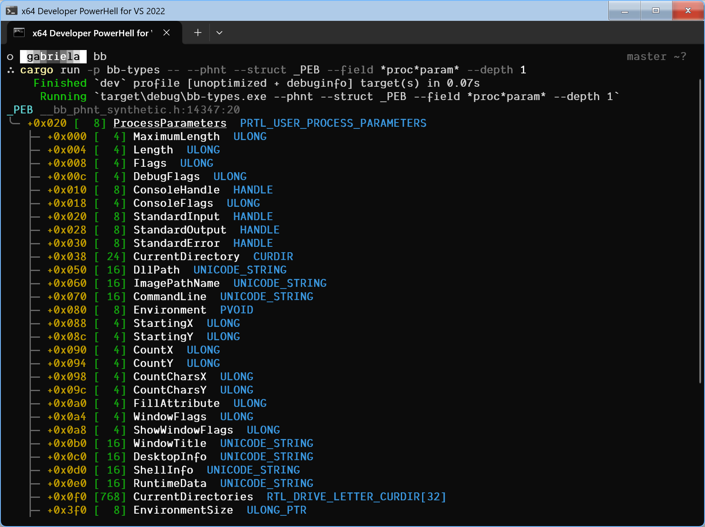
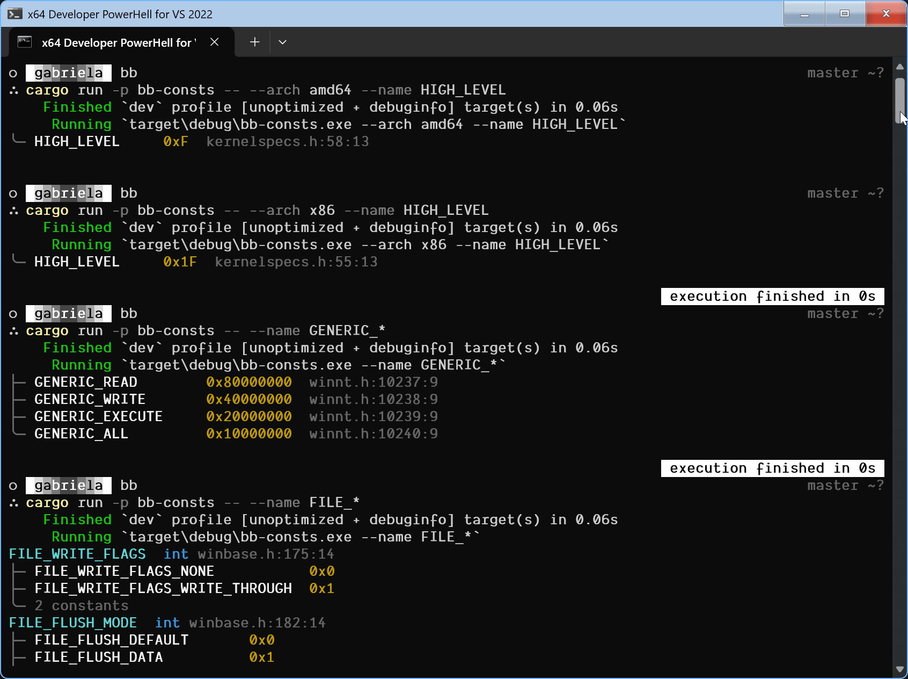
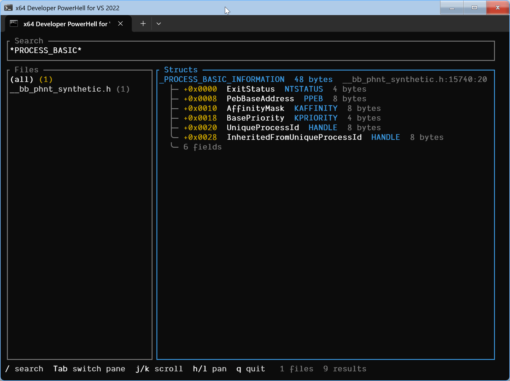
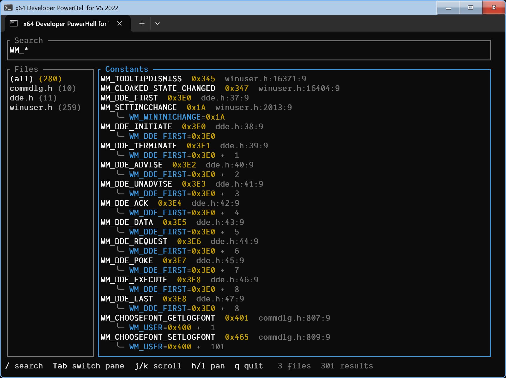
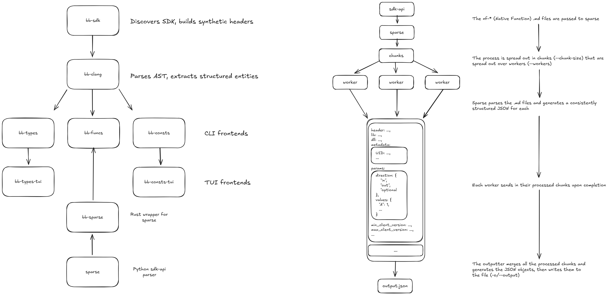

<div align="center">

# bb

**Benowin Blanc** — Windows through a detective's lens.

A set of command-line tools that parse **Windows SDK** and **PHNT** headers via libclang
and let you inspect what's actually in them: struct layouts, field offsets,
enum values, constants, `#define` macros — the works.

Think of it as `dt` from WinDbg, but you don't need a debugger running,
and it works against any SDK version, architecture, or PHNT release you throw at it.

</div>

---

<br>

<table>
<tr>
<td width="50%">
<h3 align="center">bb-types</h3>
<p align="center"><sub>Struct and class layouts, right in your terminal</sub></p>

<p align="center"></p>

</td>
<td width="50%">
<h3 align="center">bb-consts</h3>
<p align="center"><sub>Constants, enums, and macro definitions</sub></p>

<p align="center"></p>

</td>
</tr>
</table>

<table>
<tr>
<td width="50%">
<h3 align="center">bb-types-tui</h3>
<p align="center"><sub>Interactive struct browser</sub></p>

<p align="center"></p>

</td>
<td width="50%">
<h3 align="center">bb-consts-tui</h3>
<p align="center"><sub>Interactive constant browser</sub></p>

<p align="center"></p>

</td>
</tr>
</table>

<br>

---

## What is this?

Windows ships with thousands of C/C++ headers (the **Windows SDK**) that define every struct, enum, constant, and macro the OS exposes. Separately, the community-maintained **PHNT** (Process Hacker NT headers) documents internal structures that Microsoft doesn't publish.

`bb` parses these headers with **libclang** and gives you fast, searchable, pretty-printed access to all of it **(hell, even TUIs!)** — no debugger, no IDE, no digging through `.h` files by hand.

<table>
<tr></tr>
<tr>
<td>

**You might want this if you...**

- Reverse-engineer Windows internals;
- Write kernel drivers or need to check struct layouts across architectures;
- Want a quick `dt`-style lookup without spinning up WinDbg;
- Need to export struct/constant definitions as JSON for your own tooling;
- Are just curious about what's inside those headers!

</td>
</tr>
</table>

---

## Quick start

### Building

On a Windows host, you will need the following:
- Visual Studio 2019/2022 **Build Tools**
- LLVM + Clang (**libclang.dll**) version **>=18.1**
- Rust **2024 edition**

Afterwards, you may produce the binaries by invoking the following command:

```bash
cargo build --release
```

### First commands

**Inspect a struct layout:**

```bash
bb-types --struct _PEB
```

**Recurse into nested types:**

```bash
bb-types --phnt --struct PEB --depth 2
```

**Search for constants by wildcard:**

```bash
bb-consts --name GENERIC_*
```

**Scope to a specific enum:**

```bash
bb-consts --enum _MINIDUMP_TYPE
```

**Use `Enum::Constant` syntax to search within enums:**

```bash
bb-consts --name "_MINIDUMP_TYPE::*"
```

**Target a different architecture from your host:**

```bash
bb-types --arch arm64 --struct _CONTEXT
```

**Export as JSON for your own tooling:**

```bash
bb-types --arch arm64 --struct _CONTEXT --json
```

**Typo? Both CLIs suggest close matches:**

```bash
bb-types --struct _PBE
error: no structs matching '_PBE'

  did you mean?

    _ABC
    _PSP
    _PEB
```

---

## The tools

<table>
<tr></tr>
<tr>
<td width="50%" valign="top">

### CLI applications

| Crate | What it does |
| --- | --- |
| [`bb-types`](bb-types/) | Inspect struct and class layouts |
| [`bb-consts`](bb-consts/) | Inspect constants, enums, and `#define` macros |

</td>
<td width="50%" valign="top">

### TUI applications

| Crate | What it does |
| --- | --- |
| [`bb-types-tui`](bb-types-tui/) | Interactive struct browser |
| [`bb-consts-tui`](bb-consts-tui/) | Interactive constant browser |

</td>
</tr>
</table>

<table>
<tr></tr>
<tr>
<td width="33%" valign="top">

### Libraries

| Crate | What it does |
| --- | --- |
| [`bb-clang`](util/bb-clang/) | libclang abstractions for types and constants |
| [`bb-sdk`](util/bb-sdk/) | Windows SDK / PHNT header management |
| [`bb-cli`](util/bb-cli/) | Shared CLI argument definitions |
| [`bb-tui`](util/bb-tui/) | Shared TUI framework on [`ratatui`](https://ratatui.rs/) |
| [`bb-shared`](util/bb-shared/) | Small shared utilities |

</td>
</tr>
</table>

---

## Supported headers

<table>
<tr>
<td width="50%" valign="top">

### Windows SDK

Uses whatever version is available in your Developer Command Prompt environment.

Covers **user-mode** headers (`windows.h`, `winternl.h`, `dbghelp.h`, crypto, networking, shell, COM, etc.) and **kernel-mode** headers (`ntddk.h`, `wdm.h`, `ntifs.h`, `fltkernel.h`, etc.)

```
bb-types --mode kernel --winsdk --struct *DRIVER_OBJECT*
bb-types --mode kernel --struct *EPROCESS*
```

</td>
<td width="50%" valign="top">

### PHNT

The **Process Hacker NT headers**, embedded at compile time. Exposes internal NT structures and constants that the public SDK doesn't ship.

Supports version targeting from **Win2000** through **Win11 22H2**:

```
bb-types --phnt win11 --struct _PEB
bb-consts --phnt --name "STATUS_*"
```

</td>
</tr>
</table>

---

## Architecture support

Both tools support cross-compilation via `--arch` — inspect struct layouts for any target from any host:

| Flag | Target | Notes |
| --- | --- | --- |
| `amd64` | `x86_64-pc-windows-msvc` | Default |
| `x86` | `i686-pc-windows-msvc` | |
| `arm64` | `aarch64-pc-windows-msvc` | |
| `arm` | `thumbv7-pc-windows-msvc` | |

```
bb-types --arch arm64 --struct CONTEXT
```

---

## How it works

The flow is described below:

<p align="center"></p>


We use `bb-sdk` to collect Windows SDK specific data, then we generate a SDK-specific "synthetic header" (also known as an `Unsaved`/`CXUnsavedFile` in the Clang-world) which will be passed through partial compilation with `libclang.dll` and in turn give us a `TranslationUnit`.

From the translation unit, we lift the AST entities into `bb-clang` serializable objects, and we use the information that we expose there to develop the tools.

For macros specifically, `bb-consts` does a two-pass resolution: first pass evaluates simple literals and variables, second pass substitutes known constant names into unresolved macro token streams before re-evaluating. This handles things like `#define PROCESS_ALL_ACCESS (STANDARD_RIGHTS_REQUIRED | SYNCHRONIZE | 0xFFFF)`.